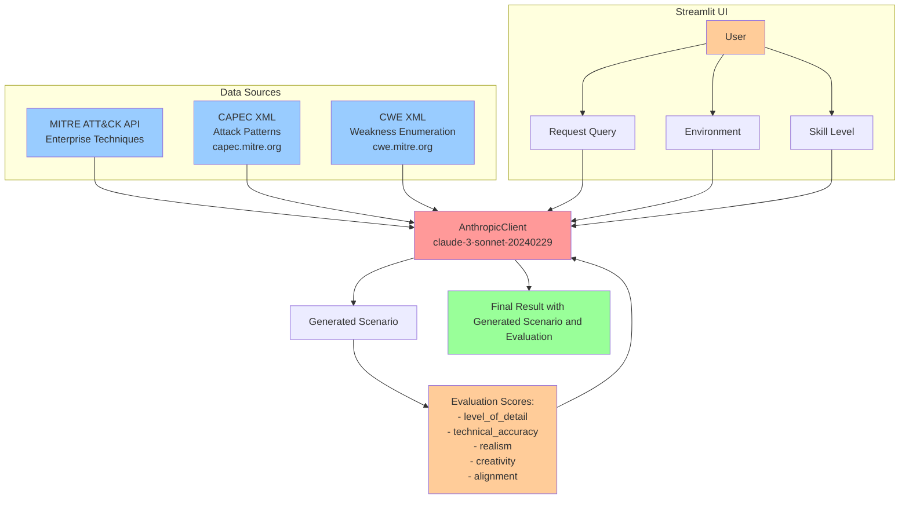

## Overview
LLM based chatbot to help generate red team scenarios utilizing ATT&CK, CAPEC, and CWE.



## Setup

### Virtual Environment
```python
python -m venv venv
source venv/bin/activate  # On Windows: venv\Scripts\activate
```

### Install packages:

```bash
pip install -r requirements.txt
```

### Configure .env
Create the .env file and add the appropriate information below
```bash
# .env file
ANTHROPIC_API_KEY=your_anthropic_key_here
ANTHROPIC_MODEL=claude-sonnet-4-20250514

# Optional: Custom database path
VECTOR_DB_PATH=./chroma_db
COLLECTION_NAME=redteam_scenarios
```

### Setup and test the Vector DB

Run test_vector_db.py

### Test LLM Configuration

Run test_llm_client.py

### Test LLM With Vector DB
Run test_scenario_generation.py - This will run the scenario generation end to end and test

### Test Evaluator
Run test_evaluator.py

### Running Application
#### Commandline
interactive/chatbot.py

#### StreamLit
```bash
pip install streamlit
streamlit run streamlit_app.py
```

